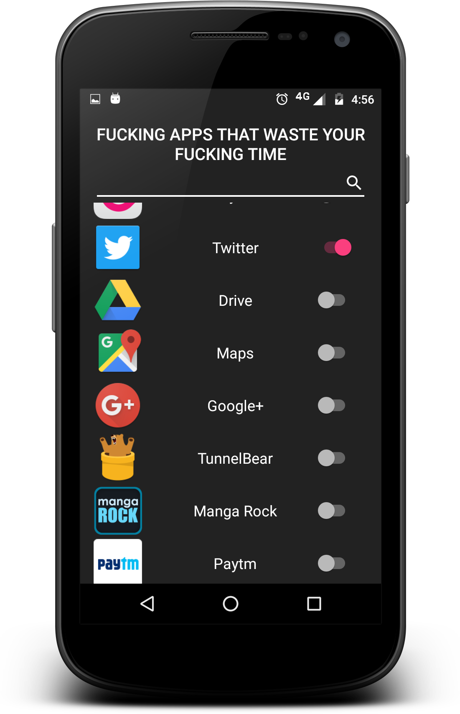
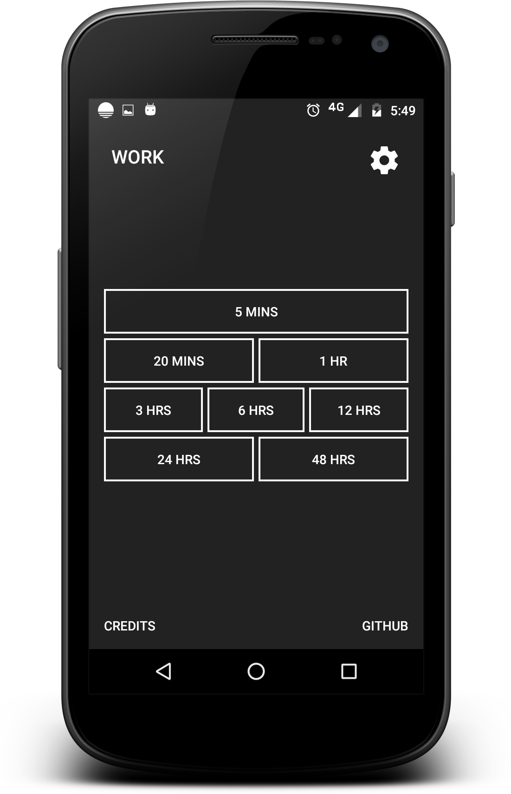

# GET TO WORK

Android port of the awesome chrome plugin [GO FUCKING WORK](goo.gl/EIYytN ) by [Alexander Lam](https://twitter.com/hialexlam)

## Features
- Search and choose the apps to block

- Choose the time to disable the app lock

## How
The app uses an **Accessibility Service** to track the currently launched app and launches an app lock with an abusive message to *inspire* you to go back to work

# Credits
This is just an **open source** **NOT FOR PROFIT** Android port of the original chrome plugin by [Alexander Lam](https://twitter.com/hialexlam) the credit for the entire idea lies with him, I just wanted this app to exist really badly.
